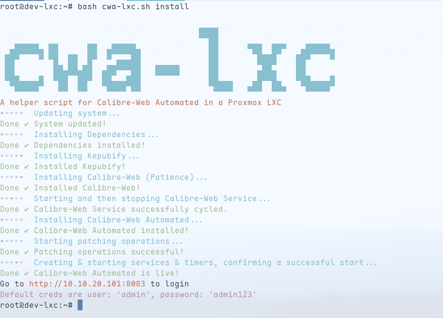

# Calibre-Web Automated LXC

## Many Thanks

Before going any further, I have to hand it to the creators of Calibre-Web and Calibre-Web Automated, Jan B (janeczku) and crocodilestick: without their hard work, this would not be possible. Please support their work over this project, even if you use this one.

### [Calibre-Web](https://github.com/janeczku/calibre-web)

### [Calibre-Web Automated](https://github.com/crocodilestick/Calibre-Web-Automated)

My project stands on their shoulders, and theirs in turn stands on the shoulders of the creator(s) of Calibre - read about the history of Calibre [here](https://calibre-ebook.com/about#history).

## What is this ❓

I have created this repo to have a place to house a bash script (or a series of bash scripts) that once run, will transform your barebones Proxmox Debian 12 LXC into a full-fledged Calibre-Web Automated installation.

I originally pitched this idea to the maintainers of the [Proxmox Community Helper Scripts](https://community-scripts.github.io/ProxmoxVE/) repo, but for various reasons it was deemed too risky, likely to break spectacularly, and too much effort to maintain. They are probably right (and please do check out their [amazing and extensive library of helper scripts](https://github.com/community-scripts/ProxmoxVE)), so I am going to try to do it myself.

## What does it look like ❓

It's pretty. But you can also use `-v` to tell it to spew out all the output to the screen, if you're into that.



## How do I use it ❓

1. Start with a freshly-baked Debian 12 LXC in Proxmox (a bare-metal Debian 12 might work as well, have not tested).
   - Support for other LXCs may be added in the future
2. Download the latest version of the script.

```bash
wget https://github.com/vhsdream/calibre-web-automated-lxc/releases/download/v1.0.0/cwa-lxc.zip
```

3. Unzip (the script!)

```bash
unzip cwa-lxc.zip
```

4. Run the script as root.

```bash
bash cwa-lxc.sh [-h,--help][-v,--verbose][--no-color] install
```

## It didn't work 😿

Sorry. Please open an issue and I'll look into it.
